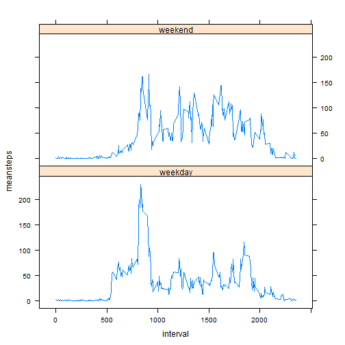

# Reproducible Research: Peer Assessment 1


## Loading and preprocessing the data

```r
data.org<-read.csv("F:/coursera/Data Science/peer assignment/RepData_PeerAssessment1/activity.csv")

data<-na.omit(data.org)
data$date<-factor(data$date)

n<-nrow(data.org[which(data.org$date=="2012-10-01"),])
data2<-data.org
data2$group<-1:n
data2$group<-factor(data2$group)
```

## What is mean total number of steps taken per day?

```r
count<-tapply(data$steps,data$date,sum)
barplot(count,
main="Simple Bar Plot",
xlab="date", ylab="total number of steps")
```

 

```r
(mean<-mean(count))
```

```
## [1] 10766
```

```r
(median<-median(count))
```

```
## [1] 10765
```

## What is the average daily activity pattern?

```r
meanna<-function(x) mean(x,na.rm=TRUE)
meanvector<-tapply(data2$steps,data2$group,meanna)
plot(data.org[which(data.org$date=="2012-10-01"),]$interval,meanvector,type="l",xlab="intervals",ylab="step")
```

 

```r
interval<-data.org[which(data.org$date=="2012-10-01"),]$interval[which.max(meanvector)]
cat(interval," 5-minute interval, on average across all the days in the dataset, contains the maximum number of steps")
```

```
## 835  5-minute interval, on average across all the days in the dataset, contains the maximum number of steps
```


## Imputing missing values
1.Calculate and report the total number of missing values in the dataset (i.e. the total number of rows with NAs)

```r
nrow(data.org)-nrow(data)
```

```
## [1] 2304
```


2.Devise a strategy for filling in all of the missing values in the dataset. The strategy does not need to be sophisticated. For example, you could use the mean/median for that day, or the mean for that 5-minute interval, etc.

We use the mean for that 5-minute interval.

```r
for(i in seq(meanvector)){
  data2[is.na(data2$steps)&(data2$group==i),"steps"]<-meanvector[i]
}
#for debug
nrow(data.org)-nrow(na.omit(data2))
```

```
## [1] 0
```

3.Create a new dataset that is equal to the original dataset but with the missing data filled in.

```r
newdata<-data2[,1:3]
head(newdata)
```

```
##     steps       date interval
## 1 1.71698 2012-10-01        0
## 2 0.33962 2012-10-01        5
## 3 0.13208 2012-10-01       10
## 4 0.15094 2012-10-01       15
## 5 0.07547 2012-10-01       20
## 6 2.09434 2012-10-01       25
```


4.Make a histogram of the total number of steps taken each day and Calculate and report the mean and median total number of steps taken per day. Do these values differ from the estimates from the first part of the assignment? What is the impact of imputing missing data on the estimates of the total daily number of steps?

```r
newcount<-tapply(newdata$steps,newdata$date,sum)
barplot(newcount,
main="Update Bar Plot",
xlab="date", ylab="total number of steps")
```

 

```r
(dfmean<-mean(count)-mean(newcount))
```

```
## [1] 0
```

```r
(dfmedian<-median(count)-median(newcount))
```

```
## [1] -1.189
```

```r
setequal(as.vector(tapply(data$steps,data$date,sum)),as.vector(tapply(newdata$steps,newdata$date,sum)))
```

```
## [1] FALSE
```
Yes,these values differ from the estimates from the first part of the assignment.Judging from the result,we know the means are the same,but the median is different,is bigger than before.After imputing missing data on the estimates of the total daily number of steps the set of steps become big,and total daily number is bigger than before.


## Are there differences in activity patterns between weekdays and weekends?

```r
newdata<-transform(newdata, weekend=as.POSIXlt(as.Date(date), format='%Y/%m/%d')$wday %in% c(0, 6))
head(newdata)
```

```
##     steps       date interval weekend
## 1 1.71698 2012-10-01        0   FALSE
## 2 0.33962 2012-10-01        5   FALSE
## 3 0.13208 2012-10-01       10   FALSE
## 4 0.15094 2012-10-01       15   FALSE
## 5 0.07547 2012-10-01       20   FALSE
## 6 2.09434 2012-10-01       25   FALSE
```

```r
newdata$dayOfWeek <- "weekday"
newdata$dayOfWeek[newdata$weekend == TRUE]<-"weekend"
newdata$interval1<-as.factor(data.org[which(data.org$date=="2012-10-01"),]$interval)
newdata<-transform(newdata,dayOfWeek=factor(dayOfWeek))
head(newdata)
```

```
##     steps       date interval weekend dayOfWeek interval1
## 1 1.71698 2012-10-01        0   FALSE   weekday         0
## 2 0.33962 2012-10-01        5   FALSE   weekday         5
## 3 0.13208 2012-10-01       10   FALSE   weekday        10
## 4 0.15094 2012-10-01       15   FALSE   weekday        15
## 5 0.07547 2012-10-01       20   FALSE   weekday        20
## 6 2.09434 2012-10-01       25   FALSE   weekday        25
```

```r
dataplot1<-data.org[which(data.org$date=="2012-10-01"),]
dataplot1$meansteps<-tapply(newdata[newdata$weekend == TRUE,]$steps,newdata[newdata$weekend == TRUE,]$interval1,mean)
dataplot1$dayOfWeek <- "weekend"
dataplot2<-data.org[which(data.org$date=="2012-10-01"),]
dataplot2$meansteps<-tapply(newdata[newdata$weekend == FALSE,]$steps,newdata[newdata$weekend == FALSE,]$interval1,mean)
dataplot2$dayOfWeek <- "weekday"
plotdata<-rbind(dataplot1,dataplot2)
library(lattice)
xyplot(meansteps ~ interval | dayOfWeek,
       ,data=plotdata,type="l", layout = c(1, 2))
```

 

